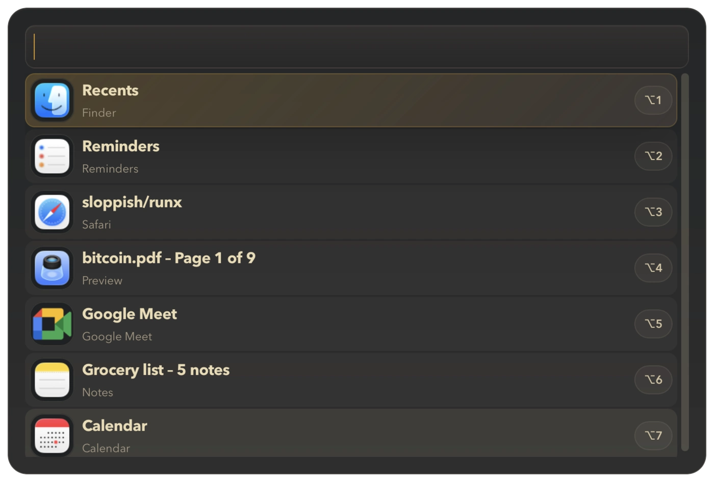

<p align="center">
  
</p>

<h1 align="center">Runx</h1>

<p align="center">
  A snappy highly-customizable macOS launcher.
  <br>
  <strong>Beta</strong> — expect rough edges and breaking changes.
</p>

<p align="center">
  
</p>

Runx is a keyboard-first macOS launcher capable of:

- jumping to open windows
- launching installed apps
- opening System Settings items
- triggering Lua plugins with command-routed actions

## Install

Via [Homebrew](https://brew.sh):

```
brew install sloppish/runx/runx
```

Or download the latest DMG from [GitHub Releases](https://github.com/sloppish/runx/releases) (no auto-updates yet).

## Compatibility

Runx targets macOS 11 Big Sur and newer.

## Docs

- [Plugin API](./docs/PLUGIN_API.md): Lua plugin API and action payloads
- [Configuration](./docs/CONFIGURATION.md): generated config reference
